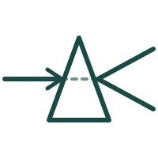
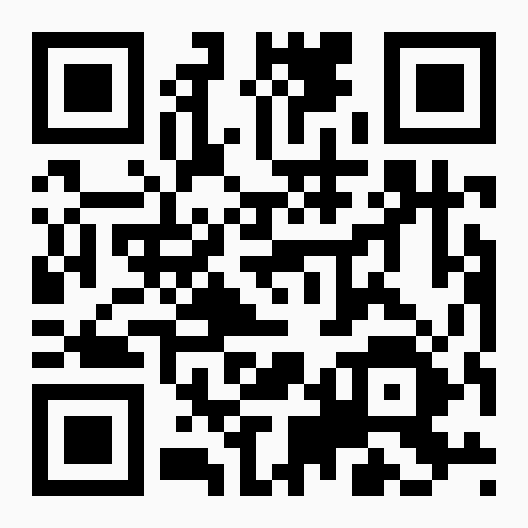

# Verification deck — image asset handoff

**For:** Next agent picking up icon + QR generation for the Overhang 2026 deck
**From:** Session `Dan (air, site-canary-institute, 20260919T1232)`
**Date:** 2026-09-19
**Deck path:** `slides/verification/verification.html`
**Related design doc:** `slides/2026-05-27-canary-minidecks-design.md` (read the "Drafting guidance" and "Brand & rendering spec" sections)

---

## What's built, what's not

**Built and verified:**
- 12-slide HTML deck at `slides/verification/verification.html`
- PDF at `slides/verification/verification.pdf`
- Voice tracks embedded as `<aside class="voice-notes">` per slide (V1 drafts — Dan edits in-file)
- Structural sketch: `slides/verification/verification-sketch.md`
- Per-slide PNG renders at `slide-01.png` … `slide-12.png` (verification artifacts — safe to delete)

**Not built (your job):**
- 11 slide icons (one per slide, except slide 11 which uses tile layout instead)
- 1 QR code pointing to `canaryinstitute.ai`

**Style anchor:** Match the light-theme, minimalist, teal-accented aesthetic of the existing decks in `slides/what-is-ai/` and `slides/hallucination/`. Icons should read as mnemonic anchors, not decoration.

---

## Brand / style constraints (from design doc)

**Colors** — use these tokens:
- `--color-bg` `#FAFAF8` — slide background (warm off-white)
- `--color-dark` `#1A2A28` — deep forest teal, primary text
- `--color-accent` `#1A4A44` — teal, brand accent
- `--color-muted` `#527872` — subdued teal, metadata
- `--color-border` `#e5e5e3` — borders

**Icon design principles:**
- Simple line-art or minimal glyphs
- Consistent stroke weight across the deck (recommend ~2px equivalent)
- Monochrome teal (`#1A4A44`) on off-white
- ~140×140 px display size (design at 2× for retina)
- SVG preferred — scales cleanly for print PDF
- If using GPT image generation for raster, output at 400×400 px minimum with transparent background

**Do NOT:**
- Use full-color illustrations — deck is monochrome-teal
- Add drop shadows or gradients
- Use emojis or icon-font characters
- Add text labels inside icons (slides already have concept titles)

---

## Icon list — per slide

Each `<div class="icon-placeholder">` in the HTML has a dashed outline and a text hint. Replace each with an `` tag pointing to the generated asset. Save assets under `slides/verification/icons/`.

| # | Slide title | Icon hint | Suggested imagery |
|---|---|---|---|
| 1 | *If you can't trust, then verify* (cover) | optical splitter / prism | Prism splitting a light beam into two parallel outputs. Bigger than other icons (~180×180). The load-bearing visual identity for the deck. |
| 2 | The frame has moved | 4 icons in a row: Coxon post · UN mark · Anthropic mark · OpenAI mark | Four small icons at 130×130 each. Simplest is stylized platform glyphs — X bird, UN emblem, Anthropic star, OpenAI knot. Monochrome teal outlines. |
| 3 | American inspectors, Soviet gates | X-ray of shipping container | Silhouette of a shipping container with an X-ray reveal effect — outline of the container, dashed interior showing a missile shape. |
| 4 | One chokepoint, one field | ASML + TSMC chokepoint | Suggestion: a funnel narrowing to a single point, with "EUV" or a chip icon at the bottleneck. Or a world map with two pins (Netherlands + Taiwan) connected by a line. |
| 5 | Silicon we both trust doesn't exist | chip with red X / hidden trojan | Stylized chip die (square with pins) with a hidden shape inside — a trojan-horse silhouette in outline. |
| 6 | Photons can't be programmed | optical splitter diagram | The mechanism diagram. Fiber-optic cable entering a splitter, two output paths — one labeled "Operator", one "Verifier". This is the most literal / diagrammatic icon in the deck. |
| 7 | Enter the sealed room | two-computer air-gap / audit chamber | Two computer boxes side-by-side inside a bounded room, connected by a line labeled with the fiber symbol. Optical airgap. |
| 8 | Random beats exhaustive | dice / lottery ball + hash symbol | Die or lottery ball with a hash symbol (`#` or `0xD34D`) emerging from it. Represents random spot-check → hash verification. |
| 9 | Inference is easy. Training is the frontier. | cluster mesh / island diagram | Grid of small chip dots connected in a mesh; some grouped into "islands". Represents DiLoCo topology. |
| 10 | Twenty-five people | silhouettes of ~25 figures | Grid of small human silhouettes — literally 25, arranged 5×5. The visual should feel sparse — this is the "how few" slide. |
| 11 | Six problem areas, all open | *(none — uses tile grid instead)* | Skip. This slide's visual is the 3×2 tile grid built into the HTML. |
| 12 | If we want to, we can (closing) | *(none — QR code goes here instead)* | Skip; see QR section below. |

---

## QR code

- **URL:** `https://canaryinstitute.ai` (confirmed with Dan)
- **Location:** Slide 12, centered below the contact info
- **Size:** 160×160 px display (recommend generating at 480×480 px)
- **Style:** Black on off-white (`#FAFAF8`) — do NOT use teal for the QR modules; scanning reliability wins over brand consistency
- **Correction level:** M or Q — leave room for print smudge tolerance
- **Save as:** `slides/verification/icons/qr-canary.png` (or `.svg` — either works)

Any QR generator will do (`qrencode` CLI, online tools, Python `qrcode` lib). Test-scan from your phone before final. Fail-open test: if it doesn't scan at 6 feet in ambient light, regenerate at higher resolution.

---

## Integration steps

For each icon:

1. Generate the asset. Save to `slides/verification/icons/slide-NN-name.svg` (or `.png`).
2. Open `verification.html`, find the corresponding `<div class="icon-placeholder">…</div>` block. Search for the hint text (e.g. `optical splitter / prism`) to jump to the right spot.
3. Replace the placeholder div with:
   ```html
   
   ```
4. Add this CSS to the `<style>` block (once, near the other `.icon-placeholder` rules):
   ```css
   .icon-real {
     width: 140px;
     height: 140px;
     object-fit: contain;
     margin-bottom: 24px;
   }
   .title-cover .icon-real { width: 180px; height: 180px; margin-bottom: 36px; }
   .icon-row .icon-real { width: 130px; height: 130px; margin-bottom: 0; }
   ```
5. For the QR (slide 12), replace the `<div class="qr-placeholder">…</div>` with:
   ```html
   
   ```
   And add:
   ```css
   .closing .qr-real { width: 160px; height: 160px; }
   ```

---

## Verification steps after each round

The `creating-slides` skill flags **silent overflow** — content past 5.5in of vertical space gets clipped with no error. Always re-verify after asset swaps.

```bash
# 1. Regenerate PDF (from slides/verification/ directory)
/Applications/Google\ Chrome.app/Contents/MacOS/Google\ Chrome \
  --headless --disable-gpu --no-pdf-header-footer \
  --print-to-pdf=verification.pdf \
  --virtual-time-budget=5000 \
  file:///Users/dan/code/websites/site-canary-institute/slides/verification/verification.html

# 2. Render pages to PNG
pdftoppm -png -r 90 verification.pdf slide

# 3. Visually inspect each slide-NN.png — check for clipped content near the bottom.
#    Slides 3, 5, 7, 8, 10 have 5 beats and are closest to the vertical limit.
```

If a slide overflows after an icon swap, either shrink the icon slightly or compress a beat. Don't just make text smaller globally — per the design doc, that's an anti-pattern.

---

## Commit convention

Not committed yet. Working tree has `slides/verification/` untracked. Commit convention Dan uses (from recent history: `blog: publish "The most important problem you've never heard of"`):

```
verification-deck: initial 12-slide deck for Overhang 2026
verification-deck: icons for slides N–M
verification-deck: QR code + final image pass
```

**Session identity for commits** (mandatory per Dan's CLAUDE.md — compose fresh per commit):

```bash
git -c user.name="Dan (air, site-canary-institute, <YYYYMMDDTHHMM>)" \
    -c user.email="parshall.dan@gmail.com" \
    commit -m "..."
```

Substitute `<YYYYMMDDTHHMM>` with the next session's own timestamp from its session-start hook — do **not** reuse `20260919T1232` (this session's stamp).

**Do NOT commit:**
- `slide-*.png` files — verification artifacts, delete before commit
- `verification.pdf` — check with Dan whether he wants the PDF in-repo (the `what-is-ai/` deck has its PDF committed, so precedent says yes; but confirm)

---

## Open questions for Dan (defer to him, don't guess)

1. **PDF in repo?** `what-is-ai.pdf` is committed. Match that pattern here?
2. **Voice track companion file?** `slides/what-is-ai/what-is-ai-voice-tracks.md` exists as a separate `.md`. The verification voice tracks are only embedded in the HTML right now. Extract them to `slides/verification/verification-voice-tracks.md`?
3. **Icons — GPT-generated or hand-drawn?** Design doc says Dan generates icons via GPT. Confirm you have his API access / preferred prompt style before spending cycles.
4. **Handout HTML?** Deferred per Dan's answer during structural sketch. Skip unless he asks.

---

## Related files

- `slides/verification/verification.html` — the deck
- `slides/verification/verification.pdf` — current PDF (589 KB)
- `slides/verification/verification-sketch.md` — the pre-build sketch, with Dan's decisions and open flags
- `slides/verification/slide-01.png` … `slide-12.png` — per-slide renders (safe to delete after this handoff)
- `slides/2026-05-27-canary-minidecks-design.md` — governing design doc, especially "Brand & rendering spec — locked" and "First-pass checklist"
- `slides/voice-track-style.md` — voice-track cues (relevant if voice tracks get another editing pass)
- `slides/hallucination/hallucination.html` — pattern reference for the CSS scaffold
- `logos/canary_X_bird.png` — bird mark used in footer lockup (already referenced)
- `logos/canary_logo_light.svg` — wordmark on light bg (inlined into each slide's footer SVG)
